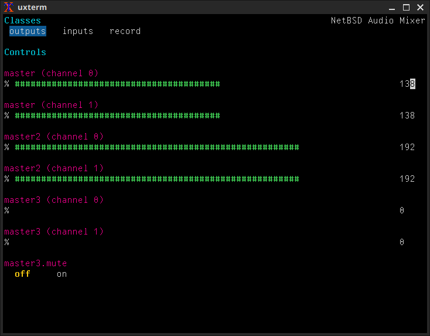

aiomixer
========

Mixer/volume control for NetBSD audio that runs in your terminal.

Screenshot
----------

Requirements
------------

* `devel/cdk` - used for rendering e.g. slider controls

Questions
---------

**Q: Could it be made to run on Solaris?**

I don't think so. While NetBSD's audio API is based on that of Solaris, they've
evolved separately, and I believe the mixer API is incompatible.

**Q: What's dacsel?**

It allows you to select the primary port. For example, on a laptop, it can
control whether audio is exclusively output to speakers, headphones, or both.

**Q: How do I control USB audio volume, or a secondary sound card?**

Your device is likely available as a secondary mixer device - try
`aiomixer -d /dev/mixer1`
